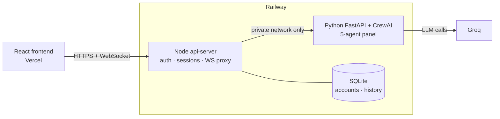

# AuraCheck

**From vibe to verified.** A live voice mock-interview platform where a panel of AI
agents doesn't just ask questions — it fact-checks your answers against your own resume
and GitHub history while you're still talking.

**[Try it live →](https://auracheck-taupe.vercel.app)**

## The problem

Practicing for interviews with a script or a chatbot doesn't catch the thing that
actually costs candidates offers: saying "I built a production backend" about a
two-commit tutorial clone. A generic mock interview can't tell the difference. AuraCheck
can, because it's listening against real evidence the whole time.

## How it works

1. Sign up, upload a resume, and optionally link a GitHub profile.
2. Start a practice room. A panel of five specialists joins live: three lead the
   conversation (HR, Technical, Projects), two work quietly in the background
   (evidence cross-checking, escalation).
3. You speak; the panel asks real, adaptive follow-ups grounded in what you've actually
   said, your resume, and your GitHub activity — not a fixed question bank.
4. After each answer, a "recommended answer" panel shows what a strong response could
   have included.
5. At the end, a Judge agent synthesizes the whole conversation into a scorecard:
   an overall score, per-dimension scores, strengths, weaknesses, red flags, and
   concrete repair steps. Every session is saved to your account and downloadable as a
   PDF.

## Architecture

Three services, each doing one job:



- **Frontend** (`frontend/artifacts/auracheck`) — React + Vite. Talks to `api-server`
  over HTTPS and a WebSocket for the live transcript stream.
- **api-server** (`frontend/artifacts/api-server`) — Node/Express. Owns accounts,
  sessions, and interview history (SQLite), and proxies the live WebSocket through to
  the Python engine. The only piece with a public URL.
- **Engine** (`backend/`) — FastAPI + CrewAI. Five agents (Alex, Dave, Sarah, Marcus,
  Judge) reason over a shared `CandidateContext` (resume text, GitHub data, live
  transcript) via Groq. Reachable only from `api-server`, over Railway's private network
  — never exposed to the internet directly.

See [backend/README.md](backend/README.md) and [frontend/README.md](frontend/README.md)
for the full breakdown of each service.

## Tech stack

| | |
|---|---|
| Frontend | React, Vite, TypeScript, TanStack Query, wouter, Tailwind |
| API layer | Node.js, Express, `node:sqlite`, `http-proxy` |
| AI engine | Python, FastAPI, CrewAI, Groq (`litellm`) |
| Voice | Web Speech API (`SpeechRecognition` / `SpeechSynthesis`) |
| Contract | OpenAPI → generated React Query hooks + Zod schemas (Orval) |
| Hosting | Vercel (frontend), Railway (both backend services) |

## Live

- **App**: https://auracheck-taupe.vercel.app
- **api-server** (Railway): https://api-server-production-582a.up.railway.app — not
  meant to be browsed directly, this is what the deployed frontend talks to.
- The CrewAI engine runs as a second Railway service with no public domain at all;
  `api-server` reaches it only over Railway's private network.

## Getting started locally

Each service has its own setup instructions:

- [backend/README.md](backend/README.md) — Python environment, `GROQ_API_KEY`, running
  the FastAPI engine, running its test suite.
- [frontend/README.md](frontend/README.md) — pnpm workspace commands, required env vars
  for both the frontend and `api-server`, and the production/cross-origin deployment
  notes.

In short: start the Python backend first (`cd backend && uvicorn main:app --reload`),
then `api-server` (`pnpm --filter @workspace/api-server run dev`), then the frontend
(`pnpm --filter @workspace/auracheck run dev`).

## Structure

```
backend/    FastAPI + CrewAI engine (resume/GitHub/speech services, the agent panel,
            session management, the live WebSocket stream)
frontend/   pnpm workspace: the React client, the Node api-server, and shared
            OpenAPI-generated packages
```

## Contributors

Sadiya Mehreen · Kaneeza Batool · Fatima Qaisar · Tayyaba Attique

## License

MIT — see [LICENSE](LICENSE).
